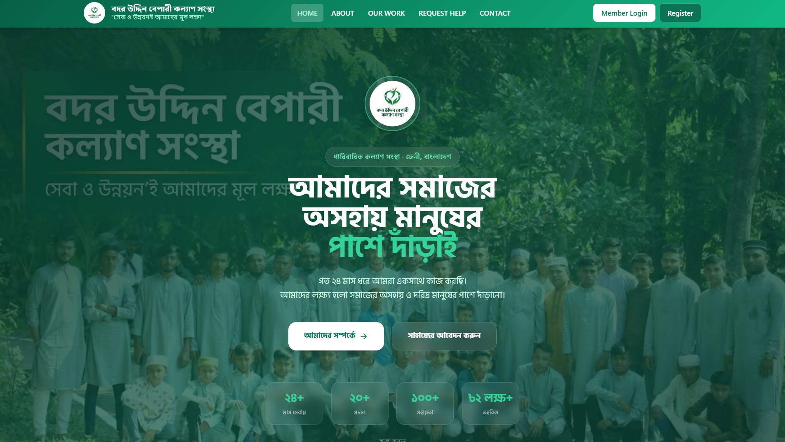
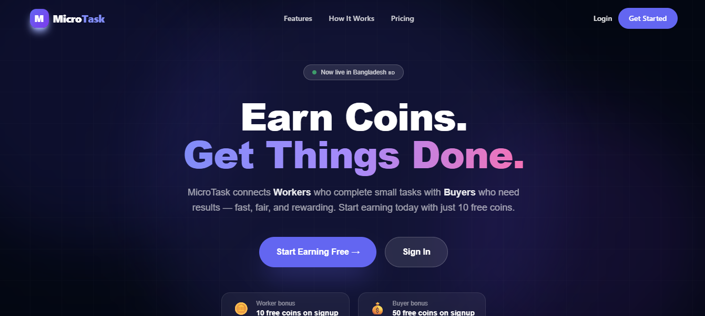
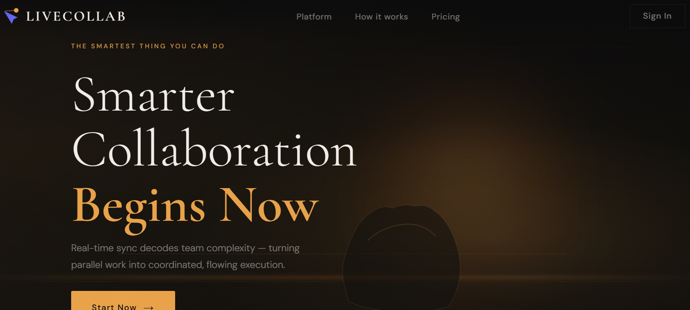
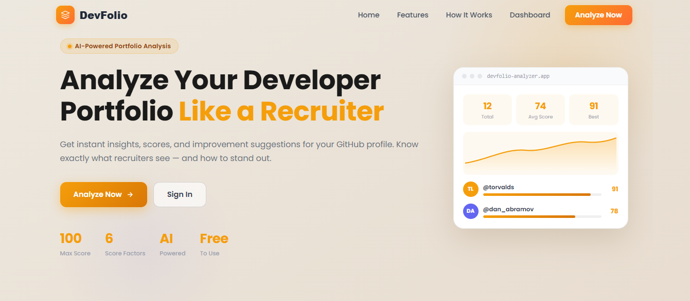
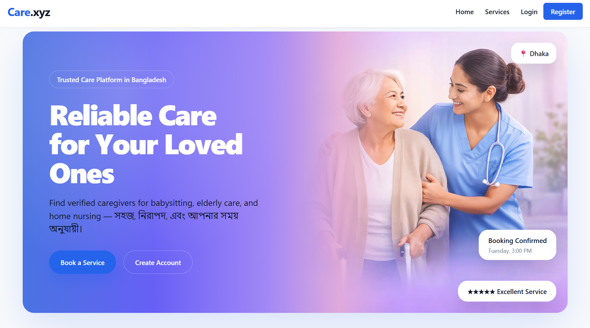
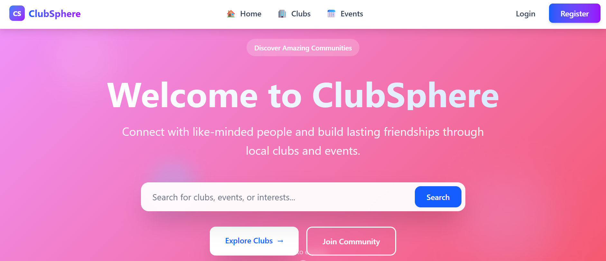

# Najmul Hasan

### Full Stack Developer · MERN Stack · Next.js

I architect and ship production-ready web applications built on the JavaScript ecosystem.  
My work spans role-based systems, real-time infrastructure, payment pipelines, and AI integrations —  
with a consistent focus on clean architecture, maintainable code, and real organizational impact.

 

 

---

## About

Full Stack Developer with a track record of delivering complete, deployed web systems — not prototypes. My background in Accounting & Finance (BBA) shaped how I think about software: requirements come from real workflows, data has business meaning, and systems need to be trustworthy before they go live.

I build across the full stack: React and Next.js for the frontend, Node.js and Express for the backend, MongoDB as the primary database. I've integrated Stripe payments, Socket.IO real-time sync, JWT/Firebase authentication, Cloudinary media management, and the Anthropic Claude API across production projects.

Currently focusing on backend architecture, API design, and scalable system patterns.

 

---

## Tech Stack

**Frontend**

**Backend & Database**

**Integrations & Services**

**Tooling & Platforms**

 

---

## Projects

> Ordered by architectural complexity, real-world impact, and system depth.

 

### Badar Uddin Welfare — Production Charity Management System

A live, organization-facing platform built to replace manual fund-tracking and approval workflows for a real charitable organization. The system implements role-based access across Admin and Member tiers, a full donation request lifecycle with admin approval gates, and Cloudinary-backed document and media handling. Designed with operational reliability as the primary constraint — data integrity and audit trails take precedence over feature surface area.

**Stack** — `React` `Node.js` `Express` `MongoDB` `JWT` `Cloudinary`

[Live Site](https://badaruddinwelfareorg.vercel.app/) · [Source Code](https://github.com/najmulcodes/badaruddinwelfare-client)

 

---

### MicroTask Platform — Multi-Role Freelance Marketplace

A complete task marketplace architected around three distinct user roles: Workers, Buyers, and Admins — each with isolated dashboards, permissions, and data views. The platform handles the full task lifecycle from posting through submission and approval, integrates Stripe for a coin-based payment system, and uses Google OAuth alongside JWT for layered authentication. Role resolution happens at the API level, not just the UI, ensuring backend authorization integrity.

**Stack** — `React` `Node.js` `Express` `MongoDB` `Stripe` `JWT` `Firebase Auth`

> **Demo access** — `admin@microtask.com` / `Admin123` (Admin role)

[Live Site](https://microtask-client-iota.vercel.app) · [Source Code](https://github.com/najmulcodes/microtask-client)

 

---

### LiveCollab — Real-Time Team Collaboration Platform

A full-stack Kanban collaboration system with sub-100ms drag-and-drop sync across all connected clients via Socket.IO. The architecture uses rooms scoped per workspace to minimize broadcast surface, optimistic UI updates with server-side reconciliation for conflict resolution, and heartbeat-based presence tracking to handle unexpected disconnects cleanly. Workspaces support invite-code-based onboarding, member management, and a persistent timestamped activity log.

**Stack** — `React` `Vite` `Tailwind CSS` `Zustand` `React Query` `Node.js` `Express` `Socket.IO` `MongoDB` `JWT`

[Live Site](https://livecollab-rho.vercel.app/) · [Source Code](https://github.com/najmulcodes/livecollab-client)

 

---

### DevFolio Analyzer — AI-Powered GitHub Profile Analysis

A full-stack analytics platform that fetches live GitHub profile data via the REST API, applies a deterministic scoring model across six weighted dimensions (repository volume, stars, follower count, activity cadence, profile completeness, and portfolio signal), then layers Anthropic Claude API-generated insights on top. The scoring pipeline runs independently of the AI layer, ensuring consistent results with graceful fallback when the API is unavailable. Authenticated users receive persistent history with score-over-time charting via Recharts; guests get immediate analysis with no friction.

**Stack** — `React` `Node.js` `Express` `MongoDB` `JWT` `GitHub REST API` `Anthropic Claude API` `Recharts`

[Live Site](https://devfolio-analyzer.vercel.app/) · [Source Code](https://github.com/najmulcodes/devfolio-analyzer)

 

---

### Care.xyz — Care Service Booking Platform

A Next.js booking platform for professional caregivers built with cascading location selectors that filter availability by district and sub-district, a dynamic pricing engine that adjusts based on service type and duration, and Firebase-backed authentication with protected booking routes enforced at both the page and API level. The architecture prioritizes the booking flow UX — reducing steps between service discovery and confirmed booking.

**Stack** — `Next.js` `React` `Firebase` `Tailwind CSS`

[Live Site](https://care-xyz-baby-sitting-elderly-care.vercel.app) · [Source Code](https://github.com/najmulcodes/Care.xyz---Baby-Sitting-Elderly-Care-Service-Platform)

 

---

### Gatherly — Community Discovery Platform

A Next.js 14 App Router platform that connects people with local communities across Bangladesh. Implements dual-provider authentication via NextAuth.js (credential-based and Google OAuth), a searchable and filterable community catalog, protected organizer routes enforced at the edge via Next.js middleware, and a community management dashboard with inline validation. Built mobile-first with a responsive layout designed for real-world browsing patterns.

**Stack** — `Next.js 14` `NextAuth.js` `Custom CSS` `localStorage`

[Live Site](https://gatherly-navy.vercel.app/) · [Source Code](https://github.com/najmulcodes/Gatherly)

 

---

### ClubSphere — Club Membership & Event Management

A MERN-stack club management system with role-scoped dashboards for administrators and members, a membership approval workflow, and event lifecycle management. Authorization is enforced at the API layer via JWT middleware — route access is determined server-side, not inferred from the client state.

**Stack** — `React` `Node.js` `Express` `MongoDB` `JWT`

[Live Site](https://clubsphere-client1.netlify.app/) · [Source Code](https://github.com/najmulcodes/clubsphere-client)

 

---

### BookHub — Book Management Platform

A full-stack CRUD platform for managing book records, demonstrating clean REST API design with Express, MongoDB document modeling, and React state management with real-time UI feedback on create, update, and delete operations. A focused project built to validate core full-stack integration patterns.

**Stack** — `React` `Node.js` `Express` `MongoDB`

[Live Site](https://bookhub-heaven.surge.sh) · [Source Code](https://github.com/najmulcodes/bookhub-client)

 

---

## GitHub Stats

&nbsp;&nbsp;

  

  

 

---

## Currently Studying

- Backend architecture patterns — service layers, repository pattern, dependency injection
- System design — database indexing, caching strategies, horizontal scalability
- TypeScript in depth — generics, conditional types, strict-mode codebases
- Open source contribution workflow and maintaining public packages

 

---

## Contact

**Email** — [najmulhasanshahin@gmail.com](mailto:najmulhasanshahin@gmail.com)  
**Portfolio** — [najmul-portfolio-six.vercel.app](https://najmul-portfolio-six.vercel.app)  
**LinkedIn** — [linkedin.com/in/najmulcodes](https://www.linkedin.com/in/najmulcodes/)  
**GitHub** — [github.com/najmulcodes](https://github.com/najmulcodes)

 

---

Available for full-time roles and freelance engagements · Dhaka, Bangladesh · Open to remote

